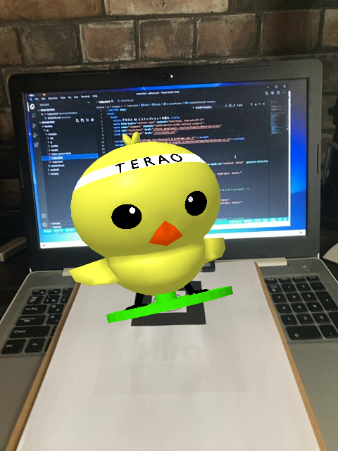

# てらぴよ AR とスナップショットを撮る

## できること

- ブラウザでカメラを起動し、てらぴよマーカー または 標準の Hiro マーカーで てらぴよ3Dを表示できる。
- 表示した てらぴよ3Dを指で回転したり二本指で拡大縮小ができる。
- てらぴよ3Dとともに写真を撮ってダウンロードできる。

### 利用イメージ

## 使用するマーカー

#### てらぴよマーカー

#### 標準の Hiro マーカー

## 動作確認環境

- iPhone 8 + Safari
- Android については未確認

## 参考文献

- [【AR.js入門】簡単にWebARで遊んでみた【A-Frame使うよ】](https://qiita.com/sakaryu/items/769a2a538baf7e4ee1c7?fbclid=IwAR2tRcrLUu5a5B6KY13qFANX1YI6Ep8f7Y_RLpKFAhYRzqBUaWRFlXmtZGY)
- [A-FrameとAR.js - スナップショットを撮る](https://qiita.com/fumix/items/7b3372688514c233068d?fbclid=IwAR0eboQ_uPPhGtohp9e2luS9OosOYetm2PF6OLYGoROMfFqamMucC362rpM)
- [Manipulate your 3D content with gestures in AR.js](https://medium.com/@fabiojcortes/manipulate-your-3d-content-with-gestures-in-ar-js-78da4c076607)